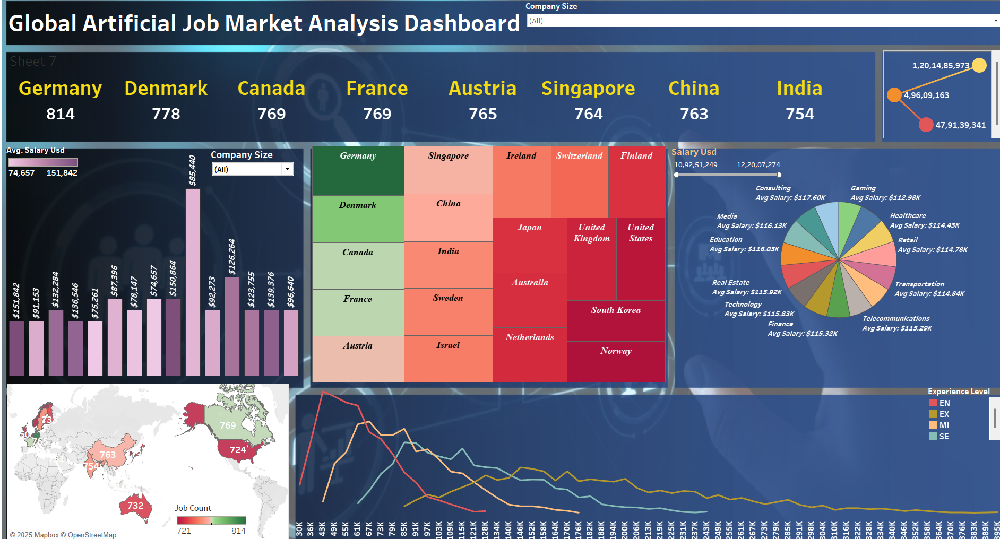

# 🌍 Global AI Job Market Analysis

This Tableau project analyzes the global AI job market using visualization dashboards. It highlights the demand for AI roles, top hiring countries, and skills required across the world.

---

## 📊 Dashboard Preview

---

## 🗂️ Project Structure

Global_AI_Job_Market_Analysis/
├── data/ # Dataset(s) used in Tableau
│ └── ai_jobs_global.csv
├── images/ # Screenshot(s) of Tableau dashboard
│ └── dashboard_preview.png
├── README.md # Project documentation

## 📌 Key Insights

- 📈 Rapid growth in AI-related job postings globally
- 🌐 USA, UK, Canada, and India among top hiring countries
- 🛠️ High demand for roles like Machine Learning Engineer, Data Scientist, and AI Researcher
- 🧠 Top skills: Python, Machine Learning, Deep Learning, NLP

---

## 💡 Tools Used

- **Tableau** – For interactive dashboards and visual analysis
- **CSV Dataset** – Sourced data on AI job listings
- **Snipping Tool** – For capturing dashboard screenshots

---

## 📥 How to Use

1. Clone the repository
2. Open the Tableau workbook using the data provided
3. Explore and interact with the visual dashboards

---